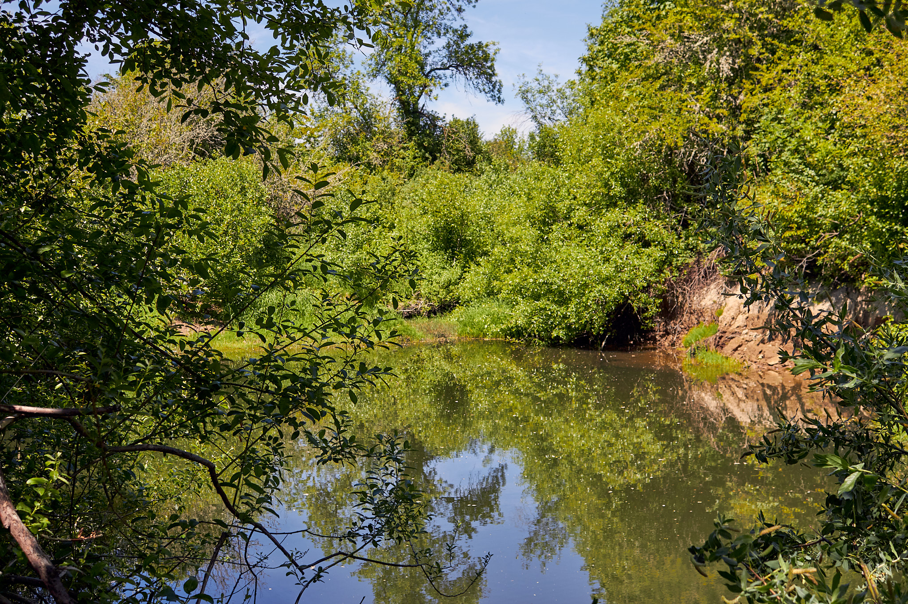
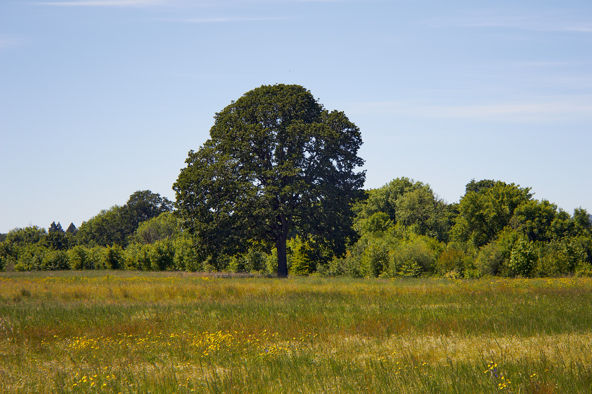
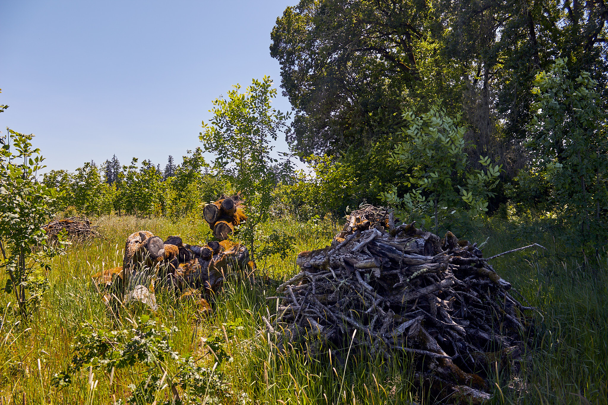
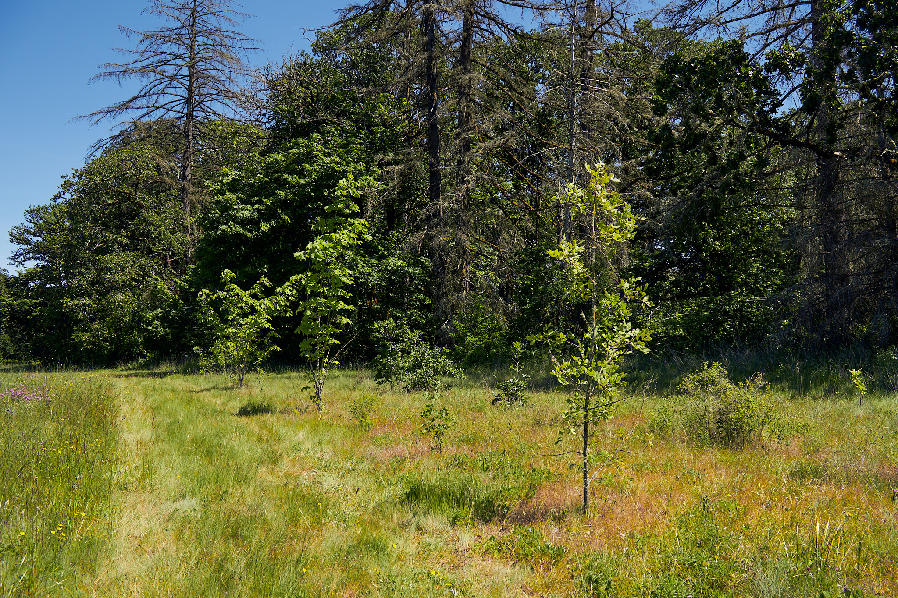
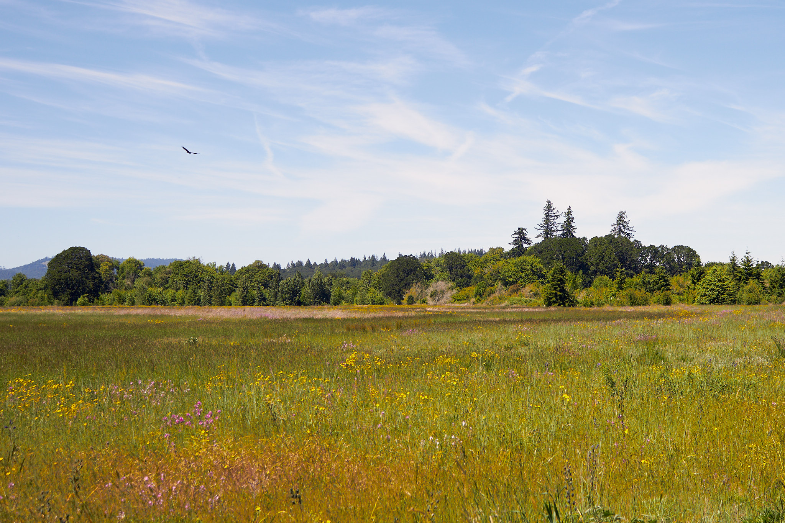
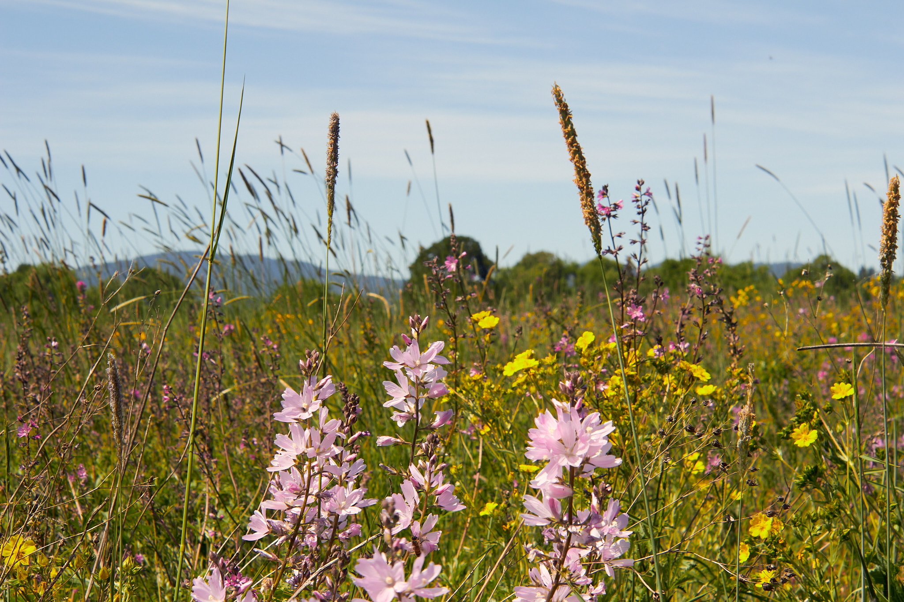
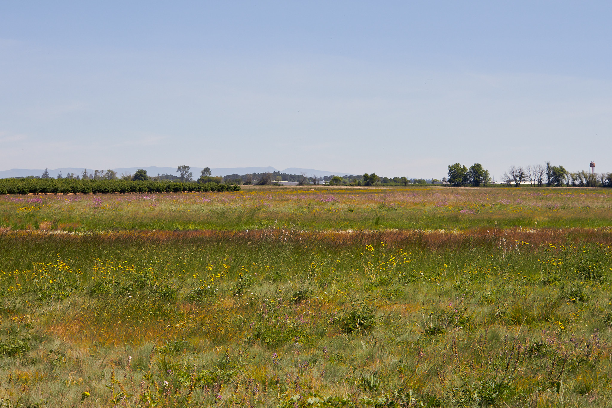

 an example to get you started
# This is a heading
## This is a subheading
### This is a subsubheading
#### This is a subsubsubheading
This is a paragraph with **bold** and *italic* text.
Check more at [Blowfish documentation](https://blowfish.page/)



